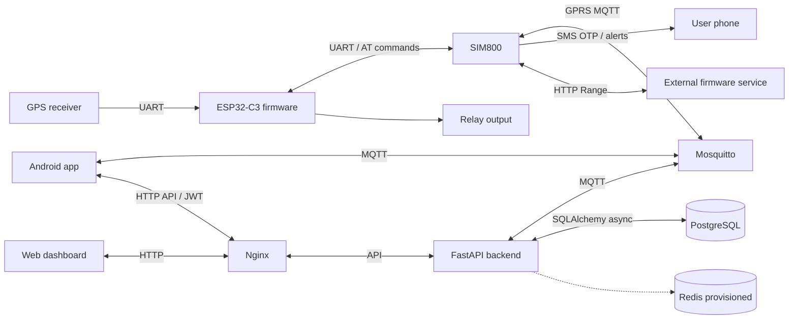

# System architecture

The three input artifacts are components of one system. The firmware gathers hardware telemetry and operates the relay; Android provides a user interface and can also produce phone telemetry; the server stores data and coordinates HTTP/MQTT workflows.

The dotted Redis connection indicates configuration/deployment intent, not active shared OTP storage in the supplied code. The external firmware service is required by the device code but absent from the server backup.

## Live location

GPSManager validates/smooths fixes. `publishGPS()` emits a JSON location. MQTTHandler resolves the topic's device UID to a database Device row, saves telemetry, updates connection state, checks geofences/speed and updates trip distance when a valid UUID session is present. Android subscribes to device topics and updates its screen/cache. The dashboard retrieves server data through same-origin HTTP.

No source selector separates the phone's Fused Location events from ESP32 messages on the same location topic. `session_id=DEVICE_ID` in firmware is not a UUID, so it does not automatically create the UUID-based trip session represented in server models.

## Login and device registration

Password login verifies a server user's password hash and returns a JWT. The SMS path posts a device UID and phone number to `/api/auth/request-otp`; the backend records pending state and publishes `auth/req`. The ESP32 generates a code and sends it by SMS. `auth/code` reports SMS status, not the OTP value. A user-entered code goes through `/api/auth/verify-otp` and MQTT `auth/verify`. A device `auth/result` completes the waiting server future.

The backend can create an unowned placeholder device for initial OTP. After a successful code verification it finds/creates the phone user and the app registers or claims the device. MQTT publishers are trusted by this protocol; a broker ACL is necessary and is not a cryptographic proof that a device-origin event came from the physical device.

## Relay control

The RelayHandler understands `start`, `kill` and `toggle`. The main firmware command handler requires a currently valid authentication session before dispatching any relay action. The session expires after 120 seconds. Commands outside that session are rejected with a serial log, without a relay error response. The RelayHandler saves state in NVS and restores it at boot.

The server has ownership-checked HTTP relay endpoints. An MQTT command can reach the device independently of HTTP, so HTTP JWT checks do not protect direct MQTT publishing. No vehicle-speed shutdown interlock exists in the firmware command handler.

## Geofences

The backend exposes generic and client-compatible geofence APIs, saves circles in PostgreSQL, pushes device config and checks telemetry against fences. The newer disk version limits checks to the device owner's fences, either device-bound or owner-global. Firmware keeps up to ten circles in RAM and can generate SMS/call/speed alerts without an online server after receiving configuration.

Android can save fence state in Room and publish firmware config directly. Server and device alert paths overlap, so test whether one event results in repeated notifications. The database model has polygon fields, but the implemented firmware and documented UI behavior here use circles.

## Offline recovery

LocationBuffer allocates monotonically increasing sequence numbers using NVS reservation blocks and stores recent points in RAM, older chunks in LittleFS. `sync/hello` announces its range/count; the server responds with `lastKnownSeq`, loaded from the database when needed. Firmware removes confirmed points and publishes its next backlog batch. A later handshake advances confirmation after persistence.

Server in-memory sequence tracking currently advances before commit succeeds. Truthy checks reject zero-coordinate backlog points. These implementation details prevent treating the protocol as a lossless transaction mechanism.

## Update process

The device uses one SIM800 TCP connection for both MQTT and HTTP firmware access. OTAManager switches between them, downloads segments, verifies the expected hash and completes the OTA update. Hash checking is transfer integrity; the current architecture has no independent signed-firmware authenticity mechanism. Active OTA also pauses normal processing in the main loop.
